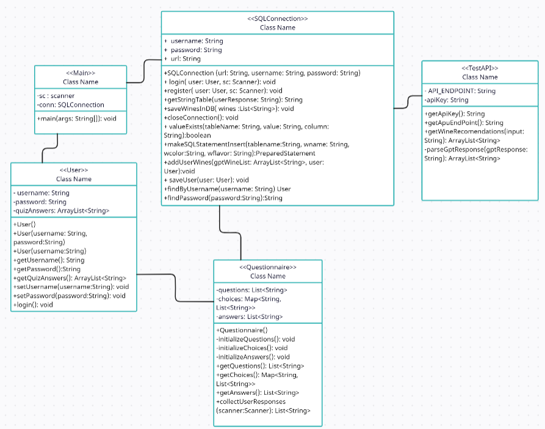

# GrapeVin – Wine Recommendation System

## Table of Contents

- [General Idea](#general-idea)
- [Execution Environment](#execution-environment)
- [Testing Procedure](#testing-procedure)
- [UML Diagram](#uml-diagram)
- [Algorithm Description](#algorithm-description)
- [Frontend](#frontend)

## General Idea
The "GrapeVin" application is a comprehensive web application aiming to recommend wine labels to users based on their personal preferences. Specifically, utilizing the GPT-3.5 artificial intelligence model, wines are selected to match the responses of a questionnaire that each user is asked to complete. This questionnaire can be filled out multiple times, giving users the opportunity to explore the various recommendations provided by the application.
The following features are provided:
- Account Registration & Login
- Update Personal Profile (Name & Surname)
- Complete/Update Questionnaire
- View Application Recommendations

## Execution Environment
The GrapeVin application operates using any integrated development environment (IDE) such as Visual Studio Code. For the database, any MySQL database can be used. 

## Testing Procedure
To test the application on a local system, the following basic steps need to be followed:
1. Database Creation: Create a MySQL database with which GrapeVin will interact. The name of this database can be arbitrary, but we suggest the existing name. You will find the `gen5/winedbase.sql` file containing the query for managing the tables. Create the tables by executing the CREATE commands.
2. Program Configuration: GrapeVin requires both connection to the database and an API key for using GPT-3.5. The appropriate details should be filled in the Main and TestAPI classes where specified.
   For creating an API key, refer here: [OpenAI API](https://openai.com/blog/openai-api)
3. Compilation of the application: The command from the terminal for compiling the application is mvn package. You may need to use mvn clean package if there are any changes to the code.
4. Execution of the program: Once the project is saved and compiled, the execution command is `java -jar target/gen5-1.0-SNAPSHOT.jar` or pressing f5 in an IDE environment.

## UML Diagram

## Algorithm Description

The GrapeVin application follows a specific algorithm to provide wine recommendations to users based on their preferences. Below is a step-by-step explanation of the algorithm:

1. **User Authentication**: When a user accesses GrapeVin, they are prompted to either log in or register for an account.

2. **Questionnaire**: After authentication, the user is presented with a questionnaire where they need to answer various questions related to their wine preferences. These questions typically inquire about factors such as color, flavor, and preferred experiences.

3. **Request Generation**: Once the questionnaire is completed, the user's responses, particularly those indicating the color and flavor of the desired wine, are embedded in a request string.

4. **Interaction with GPT-3.5 API**: The program sends the request string containing the user's preferences to the GPT-3.5 model through a REST API provided by the user. This API call aims to generate wine recommendations based on the user's input.

5. **Parsing and Filtering**: Upon receiving a response from the GPT-3.5 model, the program parses the data and filters out relevant information. It then saves this data in the database after ensuring proper validation and control over which tables the data should be stored in.

6. **Secondary Request Generation**: Additionally, the program generates another request containing all the user's responses and the data corresponding to the color of the wine chosen previously. This request aims to refine the recommendations further.

7. **Final Recommendations**: Finally, the program receives a response to the secondary request, containing refined wine recommendations. These recommendations are then displayed to the user, typically listing the top choices based on their preferences.

8. **Conclusion**: After presenting the recommendations to the user, the program closes the database connection and concludes the interaction.

This algorithm ensures that users receive personalized wine recommendations tailored to their preferences, enhancing their experience with the GrapeVin application.

## Frontend

The `frontend` folder contains the frontend code for the GrapeVin application. However, please note that it has not been successfully connected to the main program yet. The code in this folder serves as an initial draft for the frontend and may require further development and integration to function properly with the backend.

